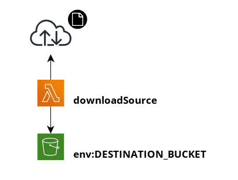

# demo-serverless-python-lambda
Serverless Framework Demo for a Python Lambda deployment that showcases how to organize, test, and deploy a project.

# Design Document

# AWS Profile
For xentity users you can setup your profile by contacting the TECH Track for credentials and Access to AWS.

Once you have your AWS Access Key ID and Secret you can configure you profile by typing `aws configure --profile xentity`. If you do not have AWS CLI installed you can download it at https://aws.amazon.com/cli/ on the right hand side.

You will also need to copy the sample.env to be .env to have your profile used by pipenv. You will know it is being used becuase when you run any pipenv run command it will print in the console `Loading .env environment variables...`

# Install Tools
If you have not done so already here are some links and instructions on the various tools that will be needed for this project.

## NodeJS
- Download and install LTS version from https://nodejs.org/en/

## Serverless Framework
- `npm i` to install the serverless drivers
## Python
- Download 3.x https://www.python.org/downloads/ and install
- Install pipenv by running `pip install --user pipenv`. More details here: https://pipenv.pypa.io/en/latest/install/

# Software Setup

After you have cloned the repo run these various command to install any required drivers for development and deployment.

- In the root folder of this project run `pipenv install` and this will install your virutalenv for python

# Testing Locally
- Go into the downloadSource folder and run `pipenv run python local.py --event events/test01.json`
- A version of this has also been put in the package.json and can be run with `npm run local:downloadsource`
# Deployment
To deploy run the command `npm run stg:deploy` or `npm run prd:deploy` depending on the stage you are publishing.

# Testing Cloud Version
- Install `npm install -g cwtail` if you want to have an easy way to view CloudWatch events from the Lambda being invoked. More details at https://github.com/kennu/cwtail
- Alternative tool can be installed at https://github.com/lucagrulla/cw (Not tested but more features)
- Run `stg:test:downloadsource` and it should invoke your Cloud function with the event01.json file and print the output to response.json

# References
- https://awscli.amazonaws.com/v2/documentation/api/latest/reference/lambda/invoke.html
